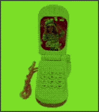
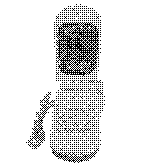

# ay ay ay im your little butterfly ay ay ay im your little butterfly

 

## build instructions
Install [uv](https://docs.astral.sh/uv/) and run:

```
uv tool install pebble-tool
pebble sdk install latest
```
if you haven't already.

Clone the repo and build:

```
git clone https://github.com/nubbybubby/pebble-toy-phone
cd pebble-toy-phone
pebble build
```

the .pbw file will be in the build directory.
